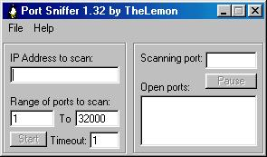



## A port sniffer

### Description

This is a program that scans (sniffs) any IP address for ports that are running TCP/IP servers.

It is ultra fast, takes about 13 minutes to scan 32,000 ports.

If you like this code, please vote for it, thanx :)
 
### More Info
 
It might slow down your internet connection while it runs, and it might also crash if you have the timeout set too low. Also, it triggered mcafee to think it's a virus after i compiled it on my computer, I think some of the code matches that of some virus out there. Don't worry though, this program isn't a virus, nor is it harmful in any way.

             |
---                |---
**Submitted On**   |2000-10-29 11:00:58
**By**             |[Corey Scott\-Walton](https://github.com/Planet-Source-Code/PSCIndex/blob/master/ByAuthor/corey-scott-walton.md)
**Level**          |Intermediate
**User Rating**    |4.3 (43 globes from 10 users)
**Compatibility**  |VB 5\.0, VB 6\.0
**Category**       |[Internet/ HTML](https://github.com/Planet-Source-Code/PSCIndex/blob/master/ByCategory/internet-html__1-34.md)
**World**          |[Visual Basic](https://github.com/Planet-Source-Code/PSCIndex/blob/master/ByWorld/visual-basic.md)
**Archive File**   |[CODE\_UPLOAD1107910292000\.zip](https://github.com/Planet-Source-Code/corey-scott-walton-a-port-sniffer__1-12386/archive/master.zip)

